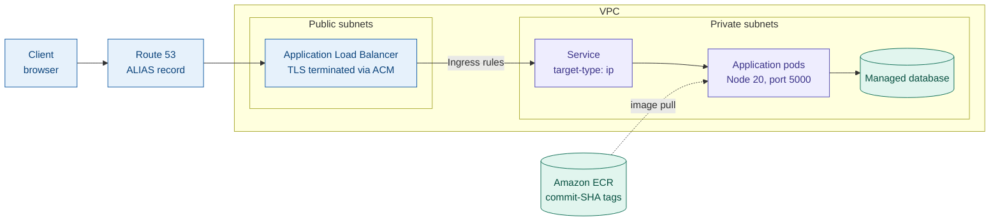
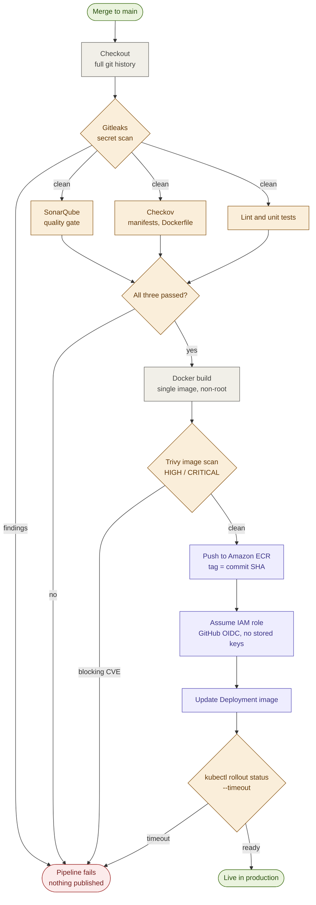
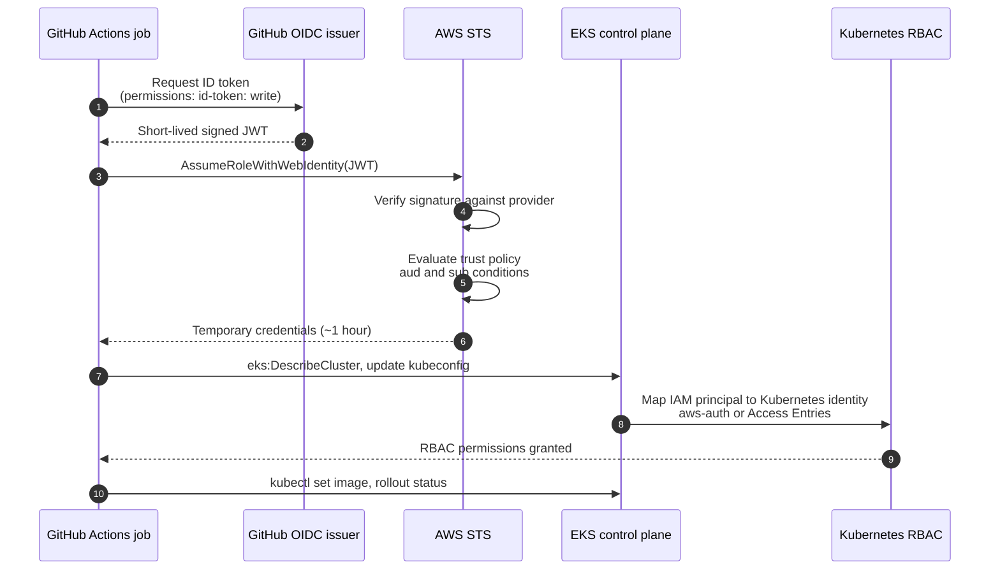

# Cloud-Native 3-Tier Application on Kubernetes (AWS EKS)

A React + Express + database app running on Amazon EKS, shipped by a GitHub Actions
pipeline that nobody has to babysit.

This README is not a feature list. It is a record of the decisions I made while building
it, in the order I made them, including the ones I would make differently now. If you are
reading this to judge whether I understand what I built, the reasoning below is the part
worth reading.

# Diagrams for README

Four Mermaid diagrams. GitHub renders these natively inside a fenced code block tagged
`mermaid` — no image export, no attachment upload. Paste each block into the section noted
above it.

---

## 1. System architecture — goes under `## Architecture`



---

## 2. CI/CD pipeline — goes under `## CI/CD pipeline`

Shows the fail paths, which is the part a flat list of stages cannot express.



Everything above `PUSH` runs on the runner. Nothing reaches the registry until every gate has
passed, which is why the four failure edges all terminate before publication.

---

## 3. Keyless authentication — goes under `## Authentication model`

A sequence diagram is the right shape here, because the ordering and the round trips are the
substance of the explanation.



Steps 8 and 9 are the ones that are easy to miss. IAM authentication reaches the control plane
API; it does not by itself confer in-cluster permissions.

---

## 4. Release and rollback states — goes under `## Image tagging and rollback`

mermaid
stateDiagram-v2
    [*] --> Building: merge to main
    Building --> Scanning: image built
    Scanning --> Rejected: HIGH or CRITICAL finding
    Scanning --> Published: gates passed
    Rejected --> [*]

    Published --> RollingOut: Deployment image updated
    RollingOut --> Live: readiness probes pass
    RollingOut --> Blocked: probes fail, maxUnavailable holds traffic
    Blocked --> RolledBack: previous SHA redeployed
    Live --> RolledBack: defect found in production
    RolledBack --> Live: previous image already in ECR
    Live --> [*]

`Blocked` is the state that matters operationally: readiness probes plus a conservative
`maxUnavailable` mean a defective release is held out of the traffic path rather than rolled
back after users have seen it.


## Notes

- Mermaid renders on github.com, in most IDE markdown previews, and on GitHub Pages. It does
  not render on npm, PyPI, or some documentation hosts — if you ever mirror this README
  elsewhere, check there first.
- `classDef` colours are optional. Removing every `classDef` and `class` line leaves valid
  Mermaid with default theming, which some reviewers prefer.
- Keep the diagrams and the prose in sync. A diagram that contradicts the text below it is
  worse than no diagram, because a reader will trust the picture.


## The constraint I started with

I could have deployed this by hand in twenty minutes. `eksctl create cluster`,
`kubectl apply`, done, screenshot for LinkedIn.

Instead I set one rule: **after the initial setup, I am not allowed to touch production.**
No local `kubectl apply` to deploy, no `docker push` from my laptop, no AWS credentials on
my machine used for anything that reaches the cluster. If I merge a pull request and the
change does not appear in production on its own, that is a bug in my pipeline, not a task
for me to finish manually.

Everything below follows from that one rule.

---

## Decision 1 — One image, not two

**What I did.** The client and the API ship as a single container. The React app is built
during the Docker build and its output is copied into the server's static directory, so one
Node process on port 5000 serves the UI and answers API calls.

**Why.** This is a small app. Two images means two builds, two scans, two tags, two
Deployments, and two things to keep in version lockstep for zero benefit at this size. One
artifact means one commit SHA describes the entire running system.

**What it costs.** I cannot scale the UI separately from the API, and I cannot release one
without releasing the other. That is a real limitation, not a hypothetical one — the moment
this had traffic that hit the API harder than the frontend, I would be paying to scale
static file serving for no reason. Splitting into two Deployments behind the same Ingress
is the first thing I would change.

**Worth saying out loud:** this is still a 3-tier design. Presentation, application, and
data are separated logically and the data tier is genuinely separate. The packaging is what
I collapsed, not the architecture.

---

## Decision 2 — The database does not live in Kubernetes

**What I did.** Managed database outside the cluster, reachable only from the private
subnets.

**Why.** A StatefulSet with a PVC would have worked and would have looked more impressive
in a repository like this. It would also have made me responsible for backups, failover,
storage class behaviour, and what happens when a node dies mid-write. Kubernetes is very
good at stateless workloads. It is merely adequate at stateful ones, and adequate is not
what you want holding your data.

**What it costs.** The cluster is no longer self-contained — you cannot recreate the whole
environment from manifests alone. I consider that a fair trade.

---

## Decision 3 — No AWS keys, anywhere

**What I did.** The pipeline authenticates to AWS through GitHub's OIDC provider. It
requests a short-lived signed token, calls `sts:AssumeRoleWithWebIdentity`, and gets
credentials that expire in about an hour. Nothing is stored in GitHub Secrets.

**Why.** The standard approach — an access key pair in repository secrets — creates a
credential that never expires, cannot be traced to a specific run, and has to be rotated by
a human who will forget. OIDC removes the secret entirely rather than protecting it better.

**The condition that makes it safe.** The IAM role's trust policy pins both the audience
and the subject:

```
aud = sts.amazonaws.com
sub = repo:itzmayank01/3-tier-user-platform-devops:ref:refs/heads/main
```

The `sub` condition is the whole thing. Without it, any repository or branch that can reach
my OIDC provider could assume my role. And the role itself grants only what a deploy
needs — ECR push and pull, describe the cluster — not `AdministratorAccess`.

**What it cost me in time.** A confusing afternoon. Assuming the IAM role authenticates you
to the *EKS API*; it does not give you permissions *inside* Kubernetes. The IAM principal
still has to be mapped to a Kubernetes identity through the `aws-auth` ConfigMap or EKS
Access Entries. Until I did that, my role was authenticating perfectly and then getting
denied by RBAC, and the error message does not make that distinction obvious.

---

## Decision 4 — Nothing enters the registry unscanned

**What I did.** Four scanners run before the image is pushed. Not after. Not on a schedule.
Before.

- **Gitleaks** on source and git history, looking for committed secrets.
- **SonarQube** on the code, with a Quality Gate that can fail the run.
- **Checkov** on the Dockerfile and Kubernetes manifests, looking for misconfiguration.
- **Trivy** on the built image, looking for CVEs in OS packages and dependencies.

**Why in that order.** Gitleaks runs alone at the front because it is the cheapest check I
have, and because a committed secret is the one finding that editing a file does not fix —
it has to be rotated. Failing in fifteen seconds is better than failing after a four-minute
build. The other three run in parallel, since none of them depends on the others.

Trivy runs after the build and before the push, which is the whole point: a vulnerable image
never reaches ECR, so it can never reach the cluster. Scanning after the push tells you the
same truth too late to act on it.

**Why four tools and not one.** They barely overlap. Gitleaks cannot see a secret that was
never committed. Checkov finds a container running as root but knows nothing about CVEs.
Trivy finds a vulnerable library but nothing about logic. SonarQube reads code and cannot
see the image at all. Dropping any one of them opens a category of problem the other three
are blind to.

**Where I chose to be lenient, and why.** I fail the build on HIGH and CRITICAL image
findings and on a Quality Gate failure. MEDIUM and LOW only warn. A pipeline that blocks on
everything is a pipeline people learn to bypass, and a bypassed gate protects nothing. For
CVEs with no upstream fix I pass `--ignore-unfixed`, so the build is not held hostage to
something unpatchable — it stays logged and rescanned, and starts failing the day a fix
ships. I never blanket-ignore a CRITICAL.

---

## Decision 5 — Commit SHAs, never `:latest`

**What I did.** Every image is tagged with the commit that produced it.

**Why.** `:latest` is mutable. Two pods can be running different code under the same tag and
you have no way to tell. With a SHA tag, any running container traces back to an exact
commit, `imagePullPolicy` behaves predictably, and rollback becomes "deploy the previous
SHA" — a specific artifact that is already sitting in the registry, not a rebuild and a
hope.

**What that buys operationally.** Rolling back is a Deployment image update against an image
that is already in ECR, so it lands in well under a minute. `kubectl rollout undo` is the
faster path; setting the image to a known previous SHA is the one I would actually run,
because it leaves a record of what I did.

The better version of this is not needing to roll back at all — readiness probes and a
sensible `maxUnavailable` mean a broken pod never receives live traffic in the first place.

---

## Decision 6 — Self-hosted runners, and what they cost

**What I did.** Moved the pipeline off hosted runners. Runtime went from roughly five
minutes to roughly two and a half.

**How I measured it.** I compared run durations in the Actions UI before and after,
averaged across several runs of the same workflow. That is my own measurement on my own
project, not a benchmark, and the parallelisation gain and the runner gain overlap rather
than add up.

**Why it got faster.** No per-job VM provisioning wait. The Docker layer cache survives
between runs. `kubectl`, the AWS CLI, and Trivy stay installed instead of being downloaded
every single time.

**What I gave up.** I would rather list this than have someone list it for me:

- I now own patching, disk cleanup, and keeping the runner alive.
- State leaks between runs, so "works on my runner" is a genuine bug class. I clean the
  workspace each run; ephemeral runners are the proper fix.
- I would never attach a self-hosted runner to a public repository where a forked pull
  request can execute arbitrary code on my machine.
- An always-on instance costs money while idle. Hosted runners bill per minute.
- One machine does not scale. The correct answer at any real size is Actions Runner
  Controller on Kubernetes — autoscaling ephemeral runner pods, which gets you the speed
  *and* a clean environment per job.

---

## Decision 7 — One load balancer, not one per service

**What I did.** A single Ingress fronted by an ALB, provisioned by the AWS Load Balancer
Controller running in the cluster. TLS from ACM, DNS through a Route 53 ALIAS record.

**Why.** A `Service` of type `LoadBalancer` creates a separate AWS load balancer per
service. That is expensive, sprawling, and gives you nowhere central to put TLS. Ingress
gives one entry point with host and path routing and certificate handling in one place.

**Two details that matter.** The controller needs its own AWS permissions, and it gets them
through IRSA — the same OIDC mechanism as the pipeline, applied to a pod's service account
instead of a workflow. And the public subnets must carry the `kubernetes.io/role/elb` tag or
the controller cannot discover where to put the load balancer, which fails silently in a way
that is annoying to diagnose.

---

## Running it

```bash
git clone https://github.com/itzmayank01/3-tier-user-platform-devops.git
cd 3-tier-user-platform-devops

docker build -t user-platform:local .
docker run -p 5000:5000 --env-file .env user-platform:local
# open http://localhost:5000
```

Against a cluster:

```bash
aws eks update-kubeconfig --region <region> --name <cluster>
kubectl apply -f k8-manifests/
kubectl rollout status deployment/<name>
kubectl get ingress
```

`kubectl get ingress` shows an empty address for a minute or two while the controller
provisions the real ALB. Once a hostname appears, point a Route 53 ALIAS record at it, or
hand that job to ExternalDNS.

Repository layout: pipeline in `.github/workflows/`, React app in `client/`, Express API in
`server/`, manifests in `k8-manifests/`, single `Dockerfile` at the root.

---

## Decisions I have not made yet

Named deliberately. Each of these is a real gap.

**Monitoring.** The largest one. I can prove a deploy succeeded; I cannot prove the error
rate did not rise afterwards. Prometheus and Grafana for application metrics, CloudWatch
Container Insights for the cluster, and alerts on error rate and p99 latency.

**Secrets handling.** Kubernetes `Secret` objects are base64-encoded, not encrypted.
Anyone with read access to the namespace can decode them. The fix is AWS Secrets Manager
with the External Secrets Operator, or Sealed Secrets, plus etcd encryption at rest via KMS.

**Autoscaling.** No HPA, no node autoscaler. Fixed capacity is a decision I made by not
making it.

**Cluster provisioning.** The workload is reproducible from manifests. The cluster is less
so. Moving provisioning into Terraform is the next substantial piece of work.

**Release strategy.** Rolling updates only. Argo Rollouts would let a canary catch a bad
release on metrics before it reaches everyone.

---

Mayank Thakur — cloud, DevOps, SRE.
[github.com/itzmayank01](https://github.com/itzmayank01) ·
[linkedin.com/in/mayankthakur1](https://linkedin.com/in/mayankthakur1)
